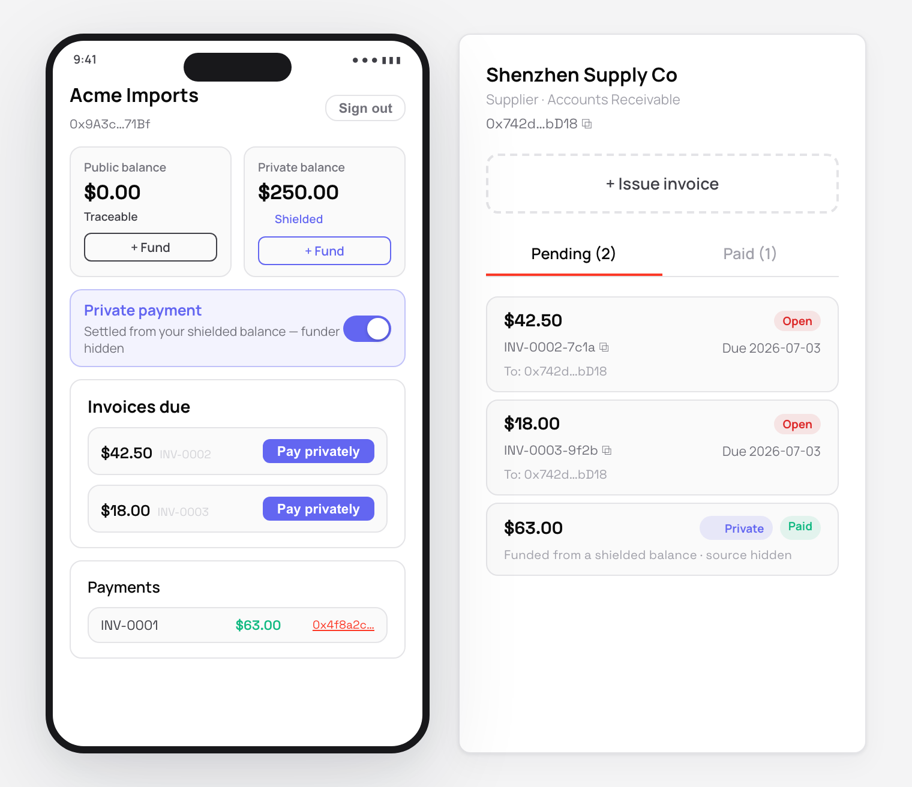

# Openfort Private Invoice Payments

Pay supplier invoices **privately** from an Openfort embedded wallet. A supplier issues invoices to
your company; you settle them through [Unlink](https://unlink.xyz)'s shielded pool on **Monad testnet**,
so the on-chain link between your treasury and the supplier is broken. The payer's embedded wallet is a
plain **EOA** with **passkey** recovery, and it is fully **non-custodial** — the spending key is derived
in the browser and never leaves it.



This recipe combines three things:

- **Openfort embedded EOA** — a self-custodial wallet on Monad testnet, secured by a passkey. It owns
  both a public balance and an Unlink shielded balance.
- **Unlink (non-custodial)** — a ZK shielded pool. The wallet derives an Unlink account from its own
  signature; the backend only registers the account and mints short-lived authorization tokens. It
  never signs.
- **Public vs private, side by side** — the same invoice can be paid two ways: a direct ERC-20 transfer
  (traceable, costs gas) or an Unlink withdraw (funder hidden, relayer-paid). The toggle makes the
  difference obvious.

## How the privacy model works

```
Openfort embedded EOA (payer treasury, Monad testnet)
        │  fund private balance          ← Unlink faucet drips shielded USDC (or deposit your own)
        ▼
   Unlink shielded pool  ─────────────────────────────────────────────┐
        │  withdraw(amount → supplier)    ← relayer settles; source     │
        ▼                                   private account is hidden    ▼
  Shenzhen Supply Co (supplier EOA)                              (one withdraw per invoice)
```

On the block explorer an observer sees funds arriving at the supplier from the Unlink pool, but **not
which account funded them** — the payer's treasury is unlinkable from the payment. A *public* payment, by
contrast, is a normal `transfer` and shows the payer → supplier edge directly.

### Custody

This is the **non-custodial (browser) Unlink model**: `account.fromMetaMask` derives the Unlink keys from
the embedded EOA's signature, and the spending key stays in the browser. The backend (`/api/unlink/register`
and `/api/unlink/authorization-token`) authenticates the Openfort session and talks to the Unlink admin API;
it cannot move funds. See Unlink's [custody models](https://docs.unlink.xyz/custody-models#app-backend).

## 1. Setup

```bash
pnpx gitpick openfort-xyz/recipes-hub/tree/main/private-payments openfort-private-payments && cd openfort-private-payments
```

## 2. Get credentials

### Openfort Dashboard ([dashboard.openfort.io](https://dashboard.openfort.io))

1. **API keys** — copy your **Publishable Key** (`pk_test_...`) and **Secret Key** (`sk_test_...`).
2. **Shield** (Shield → API Keys) — copy the **Publishable Key**.
3. Make sure your project has **Monad testnet** enabled and the **EOA** account type available.

### Unlink ([dashboard.unlink.xyz](https://dashboard.unlink.xyz))

4. Create a project for **Monad testnet** and an **API key** (server-only — copy it immediately).
5. From **Tokens**, copy the token address the faucet is configured for (this recipe was verified with a
   USDC test token, 18 decimals).

## 3. Configure environment

Create `backend/.env.local` (see `backend/.env.local.example`):

```env
PORT=3020
CORS_ORIGINS=http://localhost:5181

OPENFORT_SECRET_KEY=sk_test_...
OPENFORT_PUBLISHABLE_KEY=pk_test_...   # same project as the frontend's key

UNLINK_API_KEY=...
UNLINK_ENVIRONMENT=monad-testnet
```

Create `frontend/.env` (see `frontend/.env.example`):

```env
VITE_OPENFORT_PUBLISHABLE_KEY=pk_test_...
VITE_OPENFORT_SHIELD_KEY=...
VITE_API_BASE_URL=http://localhost:3020
VITE_UNLINK_ENVIRONMENT=monad-testnet
VITE_UNLINK_TOKEN=0x...   # your Monad-testnet token address
VITE_MONAD_RPC_URL=https://testnet-rpc.monad.xyz
```

## 4. Install & start

```bash
# Terminal 1 — backend
cd backend
pnpm i
pnpm dev

# Terminal 2 — frontend
cd frontend
pnpm i
pnpm dev
```

Open http://localhost:5181.

## Usage flow

1. **Sign in** with email (OTP), then **create a wallet with a passkey** (Face ID / Touch ID). This is
   your Monad-testnet EOA treasury.
2. **Fund the private balance** — the Unlink faucet drips shielded USDC into your account (gasless).
   Optionally fund the public balance too, to try the traceable path. Each balance shows its address:
   the **public** EOA (`0x…`, visible on the explorer) and the **private** Unlink account (`unlink1…`, hidden).
3. **Shield / unshield** — use the **Move** strip to deposit public USDC into the shielded pool
   (`depositWithApproval`, costs a little MON for gas) or unshield it back to your own EOA (`withdraw` to
   self, relayer-paid). This connects the two balances.
4. **Issue an invoice** from the supplier panel on the right.
5. **Pay it.** With the toggle on **Private**, the payment is an Unlink withdraw to the supplier — the
   supplier row shows `source hidden` and a Monad explorer link. Flip to **Public** to contrast a normal,
   traceable transfer (this one needs a little MON for gas).

## API

The backend exposes only the Unlink partner routes; everything else (balances, faucet, withdraw) happens
in the browser against the Unlink Engine.

| Method | Route | Purpose |
| ------ | ----- | ------- |
| `GET`  | `/api/health` | Liveness check |
| `POST` | `/api/unlink/register` | Register the caller's Unlink account (auth: Openfort bearer) |
| `POST` | `/api/unlink/authorization-token` | Issue a short-lived Unlink authorization token (auth: Openfort bearer) |

## Project structure

```
private-payments/
├─ backend/                         # Express API — holds the Unlink admin key, never signs
│  ├─ src/config.ts                 # Env loading
│  ├─ src/openfort.ts               # Validates the Openfort session token on the Authorization header
│  ├─ src/unlink.ts                 # createUnlinkAdmin + createUnlinkAuthRoutes
│  ├─ src/routes.ts                 # Web Fetch handler → Express adapter
│  └─ src/server.ts                 # App wiring + CORS (allows the Authorization header)
└─ frontend/                        # Vite + React payer console (+ supplier panel)
   ├─ src/openfort/                 # Monad + EOA + passkey provider stack
   ├─ src/unlink/                   # Browser Unlink client (account.fromMetaMask) + bootstrap
   ├─ src/screens/                  # Auth, Wallets, PayerDashboard, SupplierPanel
   └─ src/components/               # PhoneFrame + shared style tokens
```

## Key integration points

- **Non-custodial Unlink client** — `frontend/src/unlink/unlink.ts` calls `account.fromMetaMask({ provider })`
  with the embedded EOA's EIP-1193 provider, then `createUnlinkClient(...)`. A `customFetch` attaches the
  Openfort bearer token to `/api/unlink/*` calls only, leaving Engine requests (which carry their own
  authorization token) untouched.
- **Partner backend** — `backend/src/unlink.ts` wires `createUnlinkAuthRoutes` to authenticate via the
  Openfort session and call the Unlink admin API. The admin key registers users and mints tokens; it never
  holds wallet keys.
- **Private payment** — `useUnlink().withdraw({ recipientEvmAddress, token, amount })` settles to the
  supplier from the shielded pool. The public path is a plain `erc20.transfer` via wagmi for contrast.

## Notes & limitations

- **Monad testnet only.** The Unlink environment is `monad-testnet` (chain id `10143`). The faucet token is
  configured per Unlink project — set `VITE_UNLINK_TOKEN` to the address from your dashboard.
- **Passkeys.** Recovery is passkey-only (no server-side encryption session). Use a device/browser with a
  platform authenticator.
- **Funding.** The recipe seeds the shielded balance with the Unlink faucet for a frictionless demo. In
  production you would deposit from the treasury EOA (`depositWithApproval`); deposits are public by design,
  the withdraw is what breaks the link.
- This is an MVP focused on the integration shape, verified against `@unlink-xyz/sdk@0.3.0-canary.638` and
  `@openfort/react@1.3.0`. Add operator auth and a real store before production.
